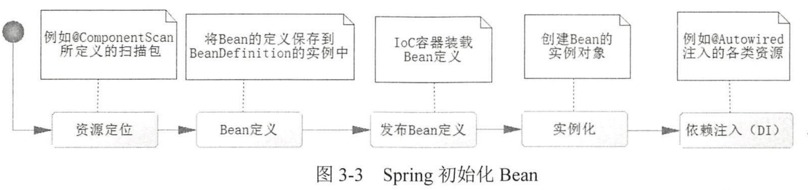
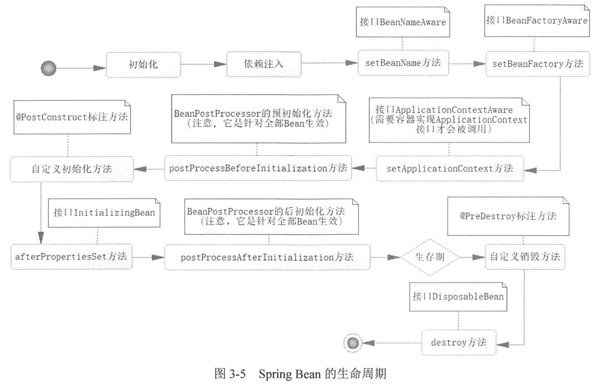

### 《深入浅出SpringBoot2.x》
---

### 目录  
- [全注解下的Spring-IoC](#全注解下的spring-ioc)  

---    

#### 全注解下的Spring-IoC
1. `IoC(Inversion of Control)`: 控制反转-->是一种通过描述来生成或者获取对象的技术；  
2. `AOP(Aspect Oriented Programming)`: 面向切面编程  
3. `Bean(Spring Bean)`: 在Spring 中把每一个需要管理的对象称为Bean，而管理 Bean的容器称为 Spring IoC容器  
4. IoC容器具备两个基本功能  
    - 通过描述管理Bean，包括发布和获取；
    - 通过描述完成Bean之间的依赖关系；
5. 注解  
    - `@Configuration`：代表一个Java配置文件，Spring的容器会根据它来生成 IoC容器去装配 Bean  
    - `@Bean`：用于告诉方法，产生一个Bean对象，然后这个Bean 对象交给Spring管理。产生这个Bean 对象的方法Spring只会调用一次，随后这个 Spring 将会将这个Bean 对象放在自己的 IOC容器中。  
    - `@Component`：最普通的组件，可以被租注入到Spring容器中进行管理，即标明哪个类被扫描进入Spring IoC容器  
    - `@ComponentScan`：标明采用何种策略去扫描装配Bean  
    - `@Service`：作用于持久层  
    - `@Repository`：作用于业务逻辑层  
    - `@Controller`：作用于表现层  
    - `@Autowired`：可以对类成员变量、方法及构造函数进行标注，完成自动转配的工作  
    - 消灭歧义
        - `@Primary`：告诉spring IoC容器，当发现有多个同样类型的Bean时，请优先使用我进行输入  
        - `@Qualifier`：当你创建多个具有相同类型的 bean 时，并且想要用一个属性只为它们其中的一个进行装配，在这种情况下，你可以使用 @Qualifier 注释和 @Autowired 注释通过指定哪一个真正的 bean 将会被装配来消除混乱。  
6. 注解详解  
- ***@Autowired:***  
    - 作用：根据属性的类型找到对应的类型（by Type）找到对应的Bean进行注入  
    - 规则：首先，会根据类型找到对应的Bean，如果，对应类型的Bean不是唯一的，那么它会根据其属性名称和Bean的名称进行匹配，如果匹配的上，就会使用该Bean，如果还无法匹配，则会抛出异常  
    - 注意：@Autowired是一个默认必须找到对应 Bean的注解，如果不能确定其标注属性一定会存在并且允许这个标注的属性为null, 则可以配置@Autowired属性 required为 false `@Autowired(required = false)`  
7. Bean生命周期
    - Bean定义  
    ```
    Bean定义大致分为以下三个步骤：  
    - Spring通过我们的配置，如@Component定义的扫描路径去找到带有@Component的类，这是一个资源定位的过程
    - 一旦找到了资源，开始进行解析，并将定义信息保存起来（此时还没有初始化Bean,也没有Bean的实例，有的仅仅是Bean的定义）
    - 然后把Bean定义发布发到 Spring IoC容器中。此时，IoC容器只有 Bean定义，没有Bean实例的生成
    ```
    - Bean的初始化  
    >  
    ```
    - ComponentScan中有一个配置项 lazyInit，只可以配置Boolean值，默认是false，即默认不进行延迟初始化
    ```
    - Bean的生存期  
    - Bean的销毁  
    >  

8. 使用属性文件  
    - 属性文件依赖  
    ```
    <dependency>
        <groupId>org.springframework.boot</groupId >
        <artifactId>spring-boot-configuration-processor</artifactId>
        <optional>true</optional>
    </dependency>
    ```
    - 配置属性  
    - 使用属性配置
        - `@Value("${database.propertyName}")`
        - `@ConfigurationProperties`
    - 使用新的属性文件
    `PropertySource(value={"classPath:fileName"}, ignoreSourceNotFound=true)`


